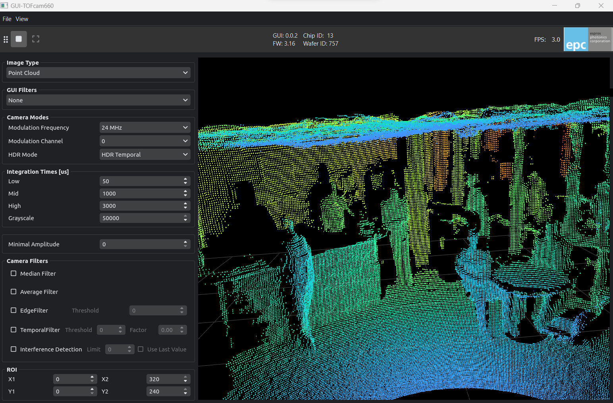

<div align="center">

</div>

# ESPROS TOFcam toolkit
The ESPROS TOFcam toolkit is designed to control and visualize ESPROS TOFcam devices.
It provides python modules for most TOFcam modules and GUI applications for interactive control and visualization.

Website: https://www.espros.com  
Documentation: https://epc-tofcam-toolkit.readthedocs.io/en/latest/  
Source code: https://github.com/espros/epc-tofcam-toolkit




## Quick-start
install the package using pip
```bash
pip install epc-tofcam-toolkit
```

Connect and startup the camera. Then simply run the gui with: 
```bash 
epc-tofcam660
epc-tofcam635
epc-tofcam611
```
- TOFcam660 will try to connect to ip-address 10.10.31.180
- TOFcam635 will try to find the com port automatically
- TOFcam611 will try to find the com port automatically

You can also manually specify the communication port
```bash 
epc-tofcam660 --ip 10.10.31.180
epc-tofcam635 --port COM3
epc-tofcam611 --port COM3
```