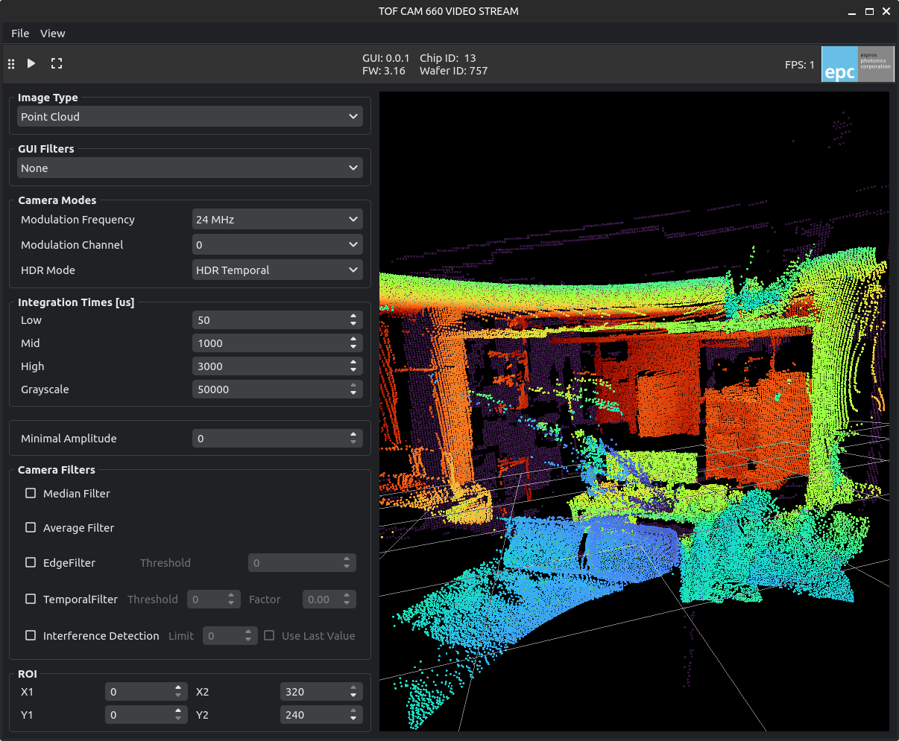

# TOF Cam GUI's
## General Overview
While each espros TOFcam implements there own control settings, the gui is structured the same for all of them. 

1. Toolbar for Start/Stop streaming and capture single images
2. Version information's for GUI, TOFcam and tof chip
3. Current Framerate
4. TOFcamera control settings
5. Image Viewer
6. Histogram and range selector


## TOFcam660
1. Make sure the camera is running and has a stable ethernet connection.  
2. Run the following command in your terminal. 
```bash 
epc-tofcam660
```

This will open the GUI application for TOFcam660. By default it tries to connect to the default ip address (10.10.31.180). 
You can specify the ip address in case your ip differs from the default one. 
```bash 
epc-tofcam660 --ip 10.10.31.180
```


## TOFcam635
1. Make sure the camera is running and has a stable serial connection. 
2. Run the following command in your terminal. 
```bash
epc-tofcam635
```

This will open the GUI application for TOFcam635. By default the camera tries to find the serial port automatically.  
You can also specify the serial port. 
```bash
# e.g. windows connected on COM3
epc-tofcam635 --port COM3
# e.g. linux/mac connected on ACM0
epc-tofcam635 --port /dev/ttyACM0
```


## TOFcam611
1. Make sure the camera is running and has a stable serial connection. 
2. Run the following command in your terminal. 
```bash
epc-tofcam611
```

This will open the GUI application for TOFcam611. By default the camera tries to find the serial port automatically.  
You can also specify the serial port. 
```bash
# e.g. windows connected on COM3
epc-tofcam611 --port COM3
# e.g. linux/mac connected on ACM0
epc-tofcam611 --port /dev/ttyACM0
```

