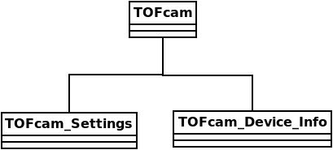

TOFcam API
==========
Every TOFcam device has its own class, which inherits from the base class `TOFcam` and implements the device-specific methods.
All TOFcam subclasses implement a TOFcam_Settings and a TOFcam_Device_Info class, which are used to store the device settings and device information, respectively.

TOFcam660 API
-------------

TOFcam660
~~~~~~~~~
.. autoclass:: epc.tofCam660.tofCam660.TOFcam660
    :noindex:
    :members:

TOFcam660_Settings
~~~~~~~~~~~~~~~~~~
.. autoclass:: epc.tofCam660.tofCam660.TOFcam660_Settings
    :noindex:
    :members:

TOFcam660_Device
~~~~~~~~~~~~~~~~
.. autoclass:: epc.tofCam660.tofCam660.TOFcam660_Device
    :noindex:
    :members:

"""

TOFcam635 API
-------------
TOFcam635
~~~~~~~~~
.. autoclass:: epc.tofCam635.tofCam635.TOFcam635
    :noindex:
    :members:

TOFcam635_Settings
~~~~~~~~~~~~~~~~~~
.. autoclass:: epc.tofCam635.tofCam635.TOFcam635_Settings
    :noindex:
    :members:

TOFcam635_Device
~~~~~~~~~~~~~~~~
.. autoclass:: epc.tofCam635.tofCam635.TOFcam635_Device
    :noindex:
    :members:

"""

TOFcam611 API
-------------
TOFcam611
~~~~~~~~~
.. autoclass:: epc.tofCam611.tofCam611.TOFcam611
    :noindex:
    :members:

TOFcam611_Settings
~~~~~~~~~~~~~~~~~~
.. autoclass:: epc.tofCam611.tofCam611.TOFcam611_Settings
    :noindex:
    :members:

TOFcam611_Device
~~~~~~~~~~~~~~~~
.. autoclass:: epc.tofCam611.tofCam611.TOFcam611_Device
    :noindex:
    :members:

"""