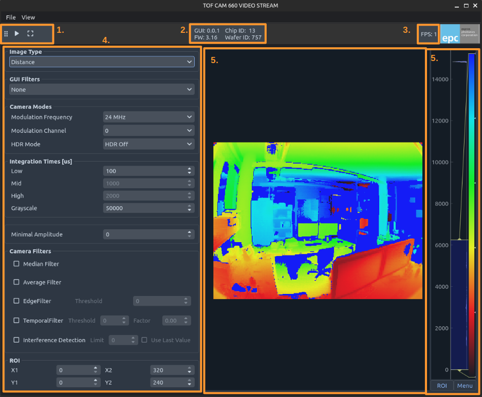
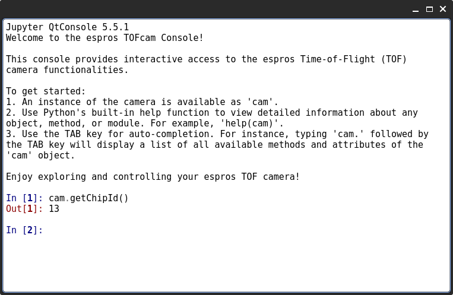
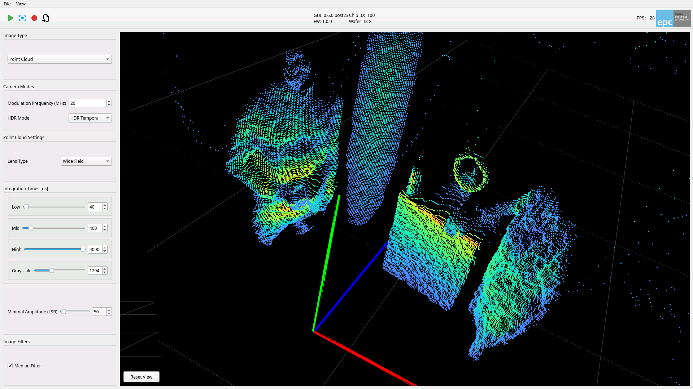
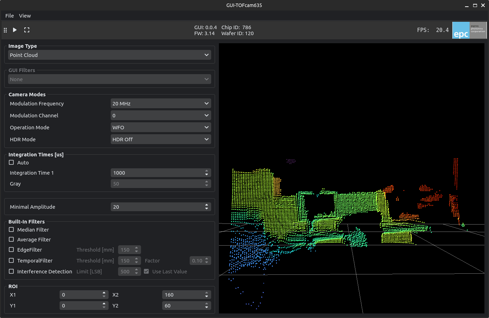
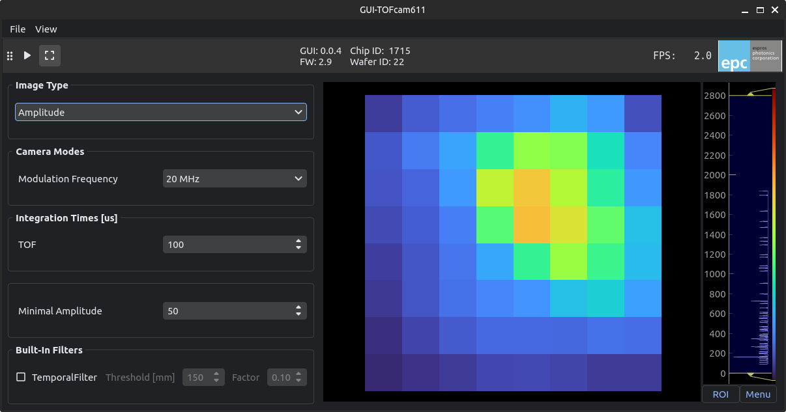
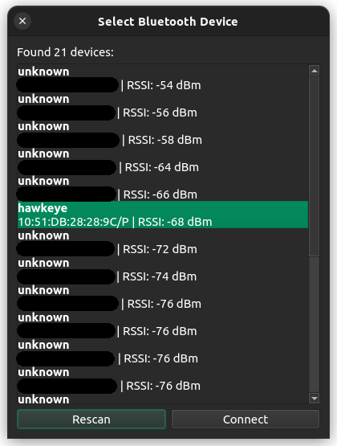
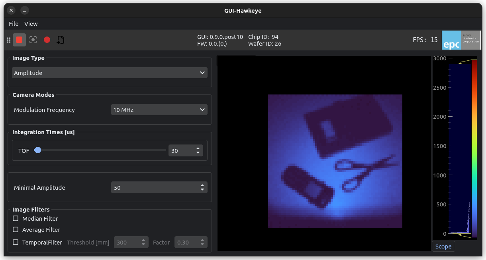

# TOFcam GUI's
## General Overview
While each ESPROS TOFcam implements there own control settings, the gui is structured the same for all of them. 

1. Toolbar for Start/Stop streaming and capture single images
2. Version information's for GUI, TOFcam and tof chip
3. Current Framerate
4. TOFcam control settings
5. Image Viewer
6. Histogram and range selector



### TOFcam console
When you click on View/Console the following iPython console opens. You can use it to explore the TOFcam API and set additional parameters.


## GUI-TOFcam670
The GUI for the epc670 Starter Kit and the epc670 ToF HAT+ currently runs only on a Raspberry Pi.
Before launching it, install all required local dependencies by including the optional `native` extras when installing `epc-tofcam-toolkit`.

```bash
pip install "epc-tofcam-toolkit[gui,native]"
```

After installation, run the following command in your terminal:
```bash
tofcam670
```



## GUI-TOFcam660
1. Make sure the camera is running and has a stable ethernet connection.  
2. Run the following command in your terminal. 
```bash 
tofcam660
```

This will open the GUI application for TOFcam660. By default it tries to connect to the default ip address (10.10.31.180). 
You can specify the ip address in case your ip differs from the default one. 
```bash 
tofcam660 --ip 10.10.31.180
```


## GUI-TOFcam635
1. Make sure the camera is running and has a stable serial connection. 
2. Run the following command in your terminal. 
```bash
tofcam635
```

This will open the GUI application for TOFcam635. By default the camera tries to find the serial port automatically.  
You can also specify the serial port. 
```bash
# e.g. windows connected on COM3
tofcam635 --port COM3
# e.g. linux/mac connected on ACM0
tofcam635 --port /dev/ttyACM0
```



## GUI-TOFcam611
1. Make sure the camera is running and has a stable serial connection. 
2. Run the following command in your terminal. 
```bash
tofcam611
```

This will open the GUI application for TOFcam611. By default the camera tries to find the serial port automatically.  
You can also specify the serial port. 
```bash
# e.g. windows connected on COM3
tofcam611 --port COM3
# e.g. linux/mac connected on ACM0
tofcam611 --port /dev/ttyACM0
```



## GUI-TOFrange611
1. Make sure the TOFrange611 is running and has a stable serial connection.
2. Run the following command in your terminal
```bash
tofrange611
```

This will open the GUI application for TOFcam611. By default the camera tries to find the serial port automatically.  
You can also specify the serial port. 
```bash
# e.g. windows connected on COM3
tofrange611 --port COM3
# e.g. linux/mac connected on ACM0
tofrange611 --port /dev/ttyACM0
```

## GUI-Hawkeye
The bluetooth connection is built upon [Bumble](https://google.github.io/bumble/). Whereas in Linux there is no extra step needed to communicate with the camera, Windows does need some steps. To use a Bluetooth USB dongle on Windows, you need a USB dongle that does not require a vendor Windows driver. In order to use the Bluetooth dongle, the driver needs to be exchanged in favor of WinUSB.
1. Connect a Bluetooth dongle
2. Prepare the system based on your [platform](https://google.github.io/bumble/platforms/index.html)
1. Power up the Hakweye
2. Run the following command in your terminal:
```bash
hawkeye
```
This will open the GUI application. By default the camera runs a scan to find the bluetooth devices nearby.



In case the MAC address is already known, one can pass it as argument:
```bash
hawkeye --mac "xx:xx:xx:xx:xx:xx"
```

