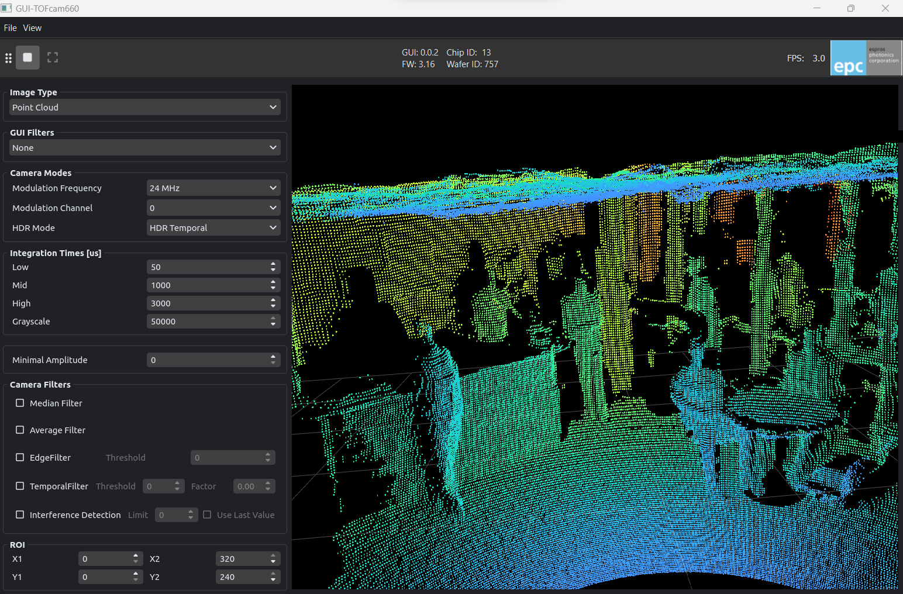

.. EPC TOFcam python package documentation master file, created by
   sphinx-quickstart on Tue Feb 13 08:30:57 2024.
   You can adapt this file completely to your liking, but it should at least
   contain the root `toctree` directive.

ESPROS TOFcam Toolkit
=====================================================

.. toctree::
   :maxdepth: 1
   
   install_instructions.md
   gui_instructions.md
   tofCam_modules.rst
   api.rst

Introduction
------------
| This package provides a python interface to the ESPROS TOFcam's.
| It also provides a simple GUI to visualize the data from the camera.

Compatibility
-------------
| This package is compatible with python 3.10 and above.
| Currently supported camera modules are:  

* `EPC670 Starter-Kit - purchase on digikey <https://www.digikey.com/en/products/detail/espros-photonics-ag/EPC670-STARTER-KIT/29535441>`_
* `TOFcam660 - purchase on digikey <https://www.digikey.com/en/products/filter/optical-sensors/camera-modules/1003?s=N4IgTCBcDaICoHsBmBjAhgWwAQDYcAYQBdAXyA>`_ 
* `TOFcam635 - purchase on digikey <https://www.digikey.com/en/product-highlight/e/espros/tof-cam-635-miniaturized-3d-camera>`_
* `TOFcam611 - purchase on digikey <https://www.digikey.com/en/products/detail/espros-photonics-ag/TOF-FRAME-611/10516851>`_
* `TOFrange611 - purchase on digikey <https://www.digikey.com/en/products/detail/espros-photonics-ag/TOF-RANGE-611/10516871>`_

.. toctree::
   :maxdepth: 2
   :hidden:
   :caption: Related Products:
   
   epctofcam-library <https://docs.espros.com/espros_processing_pipeline>
   iToF Sensors <https://docs.espros.com/epc_user_guides/user_guides/itof_imaging_guide.html>

Useful Links
------------

* `DigiKey Shop <https://www.digikey.com/en/supplier-centers/espros>`_ – Overview and ordering for available ESPROS components.
* `ESPROS Website <https://www.espros.com/>`_ – ESPROS official website with product information and company details.
* `Documentation <https://docs.espros.com/>`_ – Central hub for technical documents and APIs.
* `Datasheets <https://www.espros.com/downloads>`_ – Official downloads and data sheets.
* `GitHub Toolkit <https://github.com/espros/epc-tofcam-toolkit>`_ – Open-source repository for the epc-tofcam-toolkit.